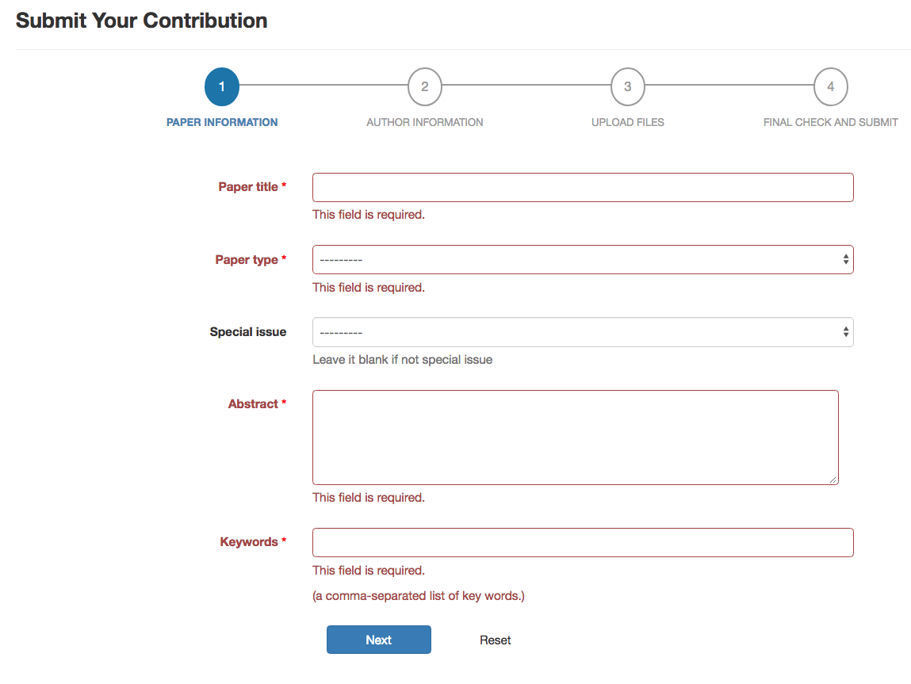

The [JIDPS Editorial System](https://jidps.rndsphere.com/) was designed, developed and maintained by a four-student group, me included, to support the editorial process for the Journal of Integrated Design and Process Science (JIDPS), for free. The Journal is the official journal of the Society for Design and Process Science (SDPS). Authors, editors, reviewers, proof editors, print agent and the Society have been connected together here through the editorial workflow.

The original system was developed based on Django 1.2.4. It was an immature and very limited version before I got involved in 2014. I introduced Bootstrap framework to make it mobile-friendly, led the refinements and automation of the editorial workflow, and planned the refactoring process of the legacy code base, using Django, Bootstrap 3, JavaScript, HTML5, CSS, and MySQL. We devoted our spare time to develop the system to make the whole process much easier. Now, hundreds of users are using the system with ease.

The following provides a screenshot of the step-by-step paper submission form with form validating, as an example.

