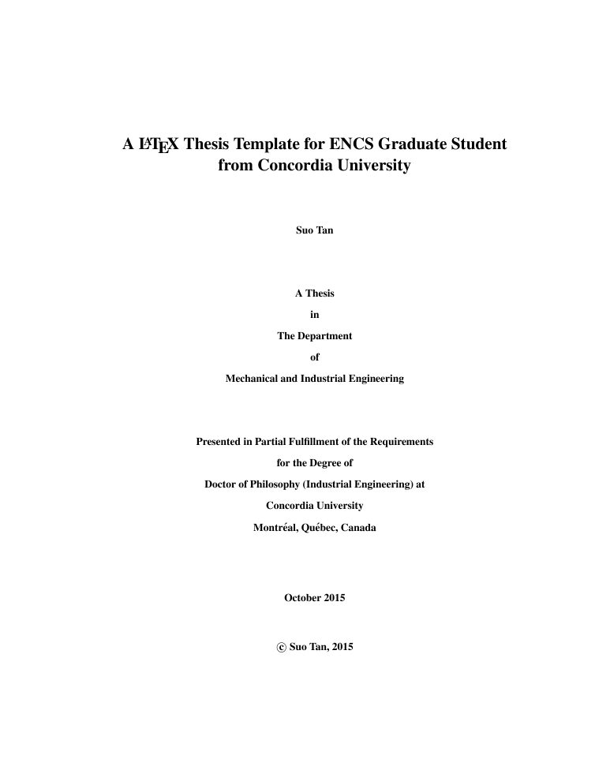
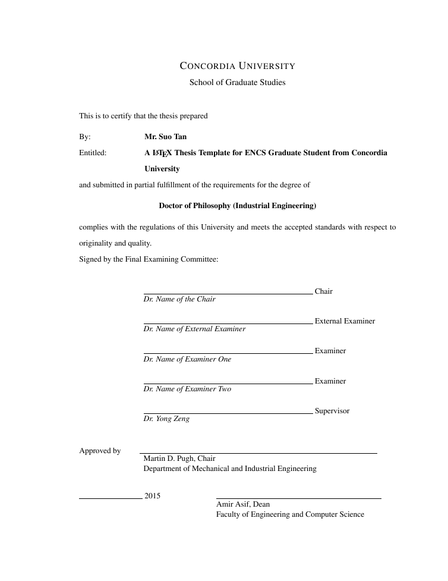
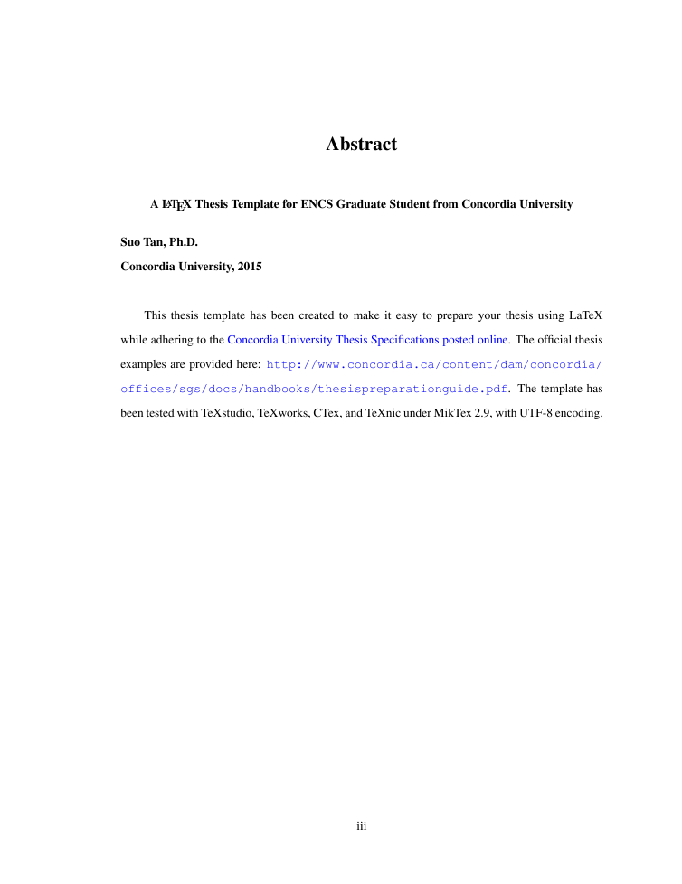
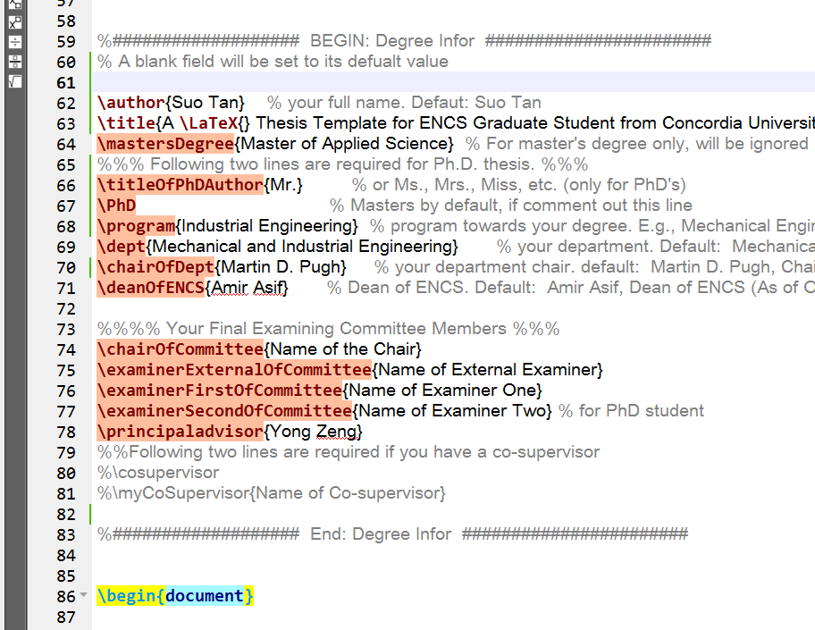

This thesis template has been created to make it easy to prepare your thesis using LaTeX while adhering to the [Concordia University Thesis Specifications posted online](https://www.concordia.ca/artsci/english/programs/graduate/english-ma/thesis-deadlines-formatting.html#format). The official thesis examples are provided here as a PDF file: http://www.concordia.ca/content/dam/concordia/offices/sgs/docs/handbooks/thesispreparationguide.pdf.

Please refer to [This GitHub page](http://tandysony.github.io/LaTeX-Thesis-Template-for-Concordia-University-Students/) for details.

## Featured Screenshots

1.  Title Page

    

2.  Signature Page

    

3.  Abstract Page

    

4.  Degree Configuration

    

## Requirements

In order to run it properly, you must have the following available

- MikTex 2.9
- A LaTeX editor, e.g., TeXstudio, Texmaker, TeXnic, or TeXworks.
- The template `ConcordiaThesis.tex` and the style file `ConcordiaU.sty`.
- Internet connection if you are running it at your first time. You may need to download necessary package(s).

## Troubleshooting

- The template has been tested with TeXstudio, TeXworks, CTex, and TeXnic under MikTex 2.9, with UTF-8 encoding. If you notice anything in the Thesis Specifications that does not match the templates, please let me know. I will make my effort to keep it up to date.

## FAQ

- Q: Why I am getting question marks `?` for the citations, and references are not shown anymore?

A: Please (1). Make sure your bibliography file (.bib) is in the folder and each item is configured correctly (pay attention to `,` and `}`. (2). Run in this sequence: `pdfLaTex` --> `bibTex` --> `pdfLaTex`. It may help.
